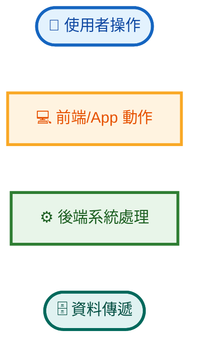
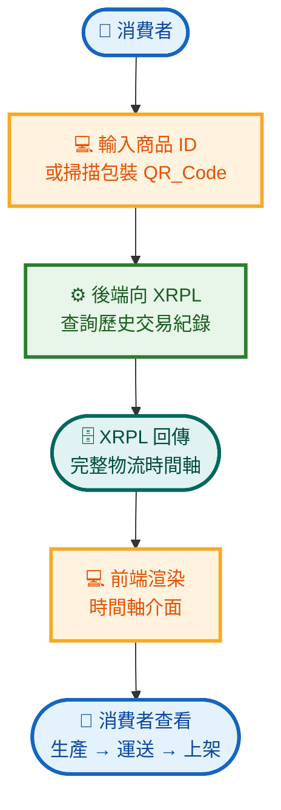
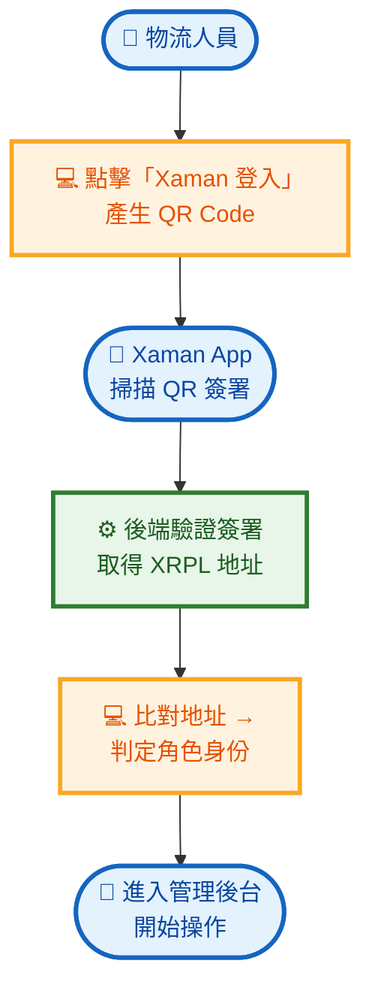
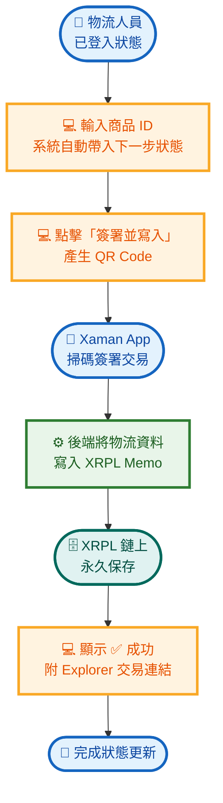
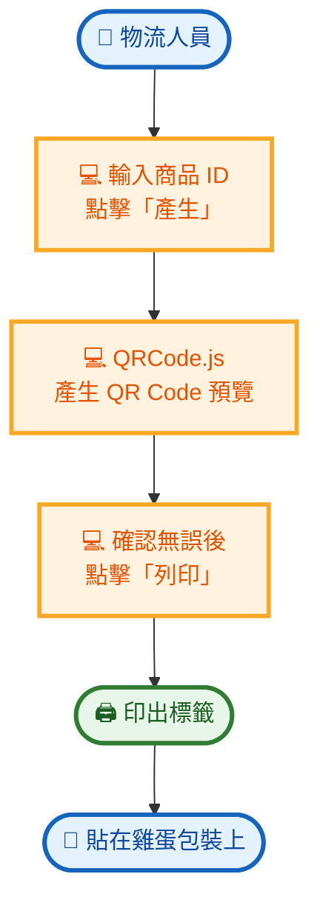
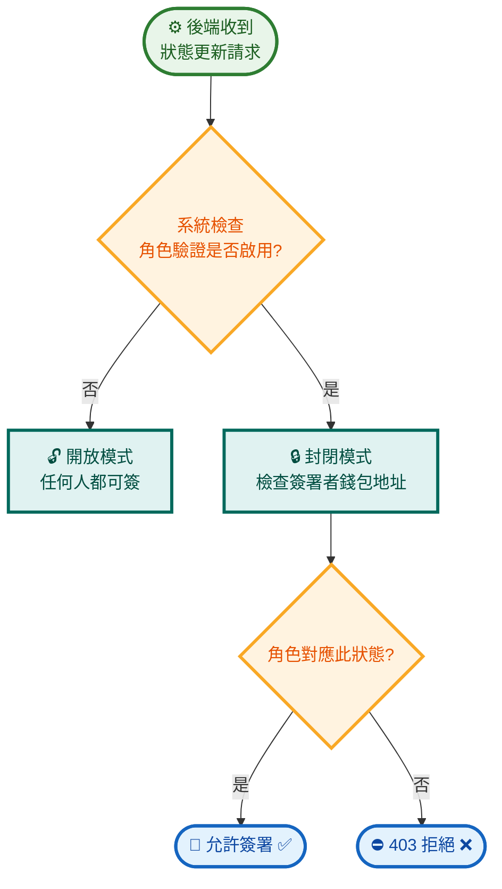
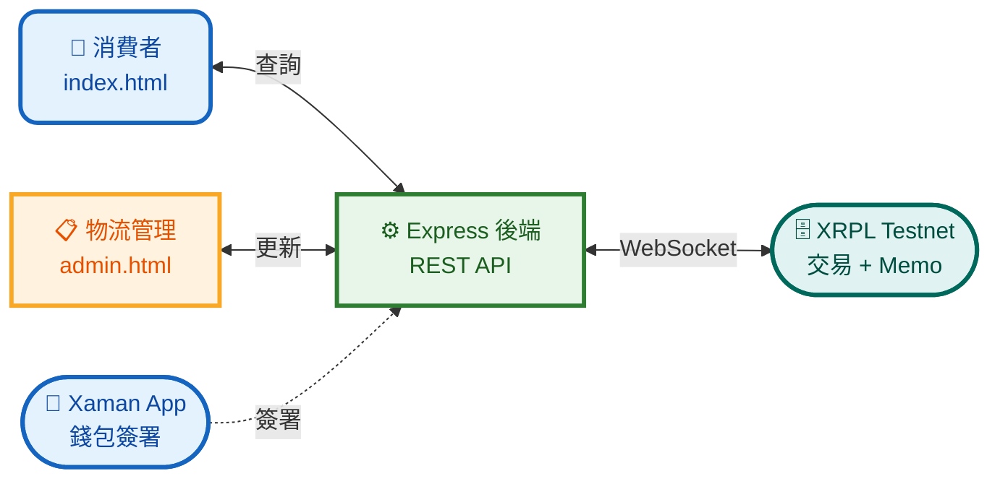

# 🥚 雞蛋產銷履歷系統 — 簡報版流程圖

> 使用情境簡化版 · 適合投影片呈現

---

## 🎨 圖例

| 圖示 | 代表 | 顏色 |
|:----:|------|:----:|
| 👤 圓角 | **使用者**操作 | 藍色 |
| 💻 矩形 | **前端**流程 | 橙色 |
| ⚙️ 矩形 | **後端**系統 | 綠色 |
| 🗄️ 圓角 | **資料**傳遞 | 青色 |

---

## 情境一：消費者查詢溯源

---

## 情境二：物流人員登入

---

## 情境三：物流狀態更新（核心）

---

## 情境四：列印商品 QR 標籤

---

## 情境五：角色權限驗證

| 狀態 | 需由誰簽署 |
|------|-----------|
| 📦 生產完成 `produced` | 🏭 **製造商** |
| 🚚 運送中 `shipped` | 🚚 **物流中心** |
| 🏪 已上架銷售 `sold` | 🏪 **零售商** |

---

## 系統資訊流總覽

---

> 📅 2026-05-23 · 🥚 雞蛋產銷履歷追蹤系統 · 簡報版流程圖
