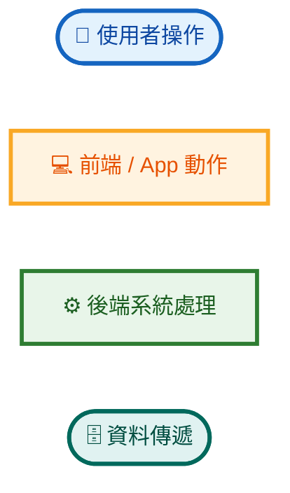
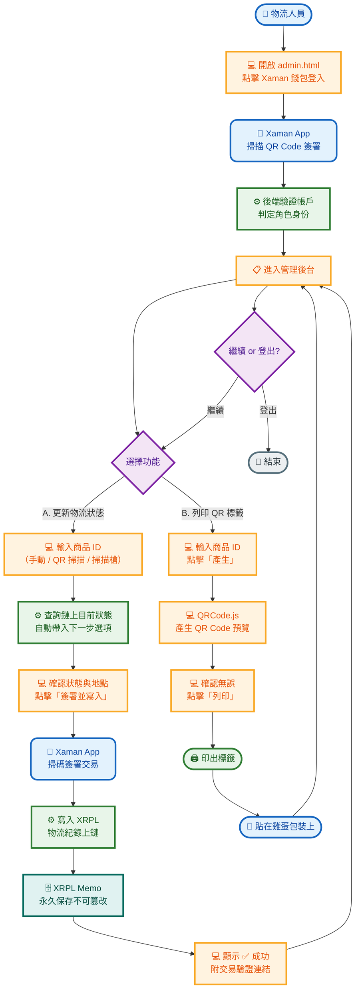
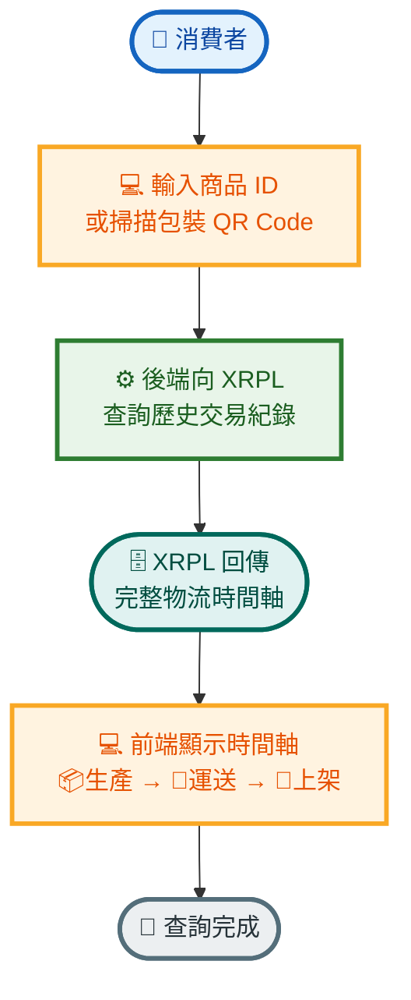
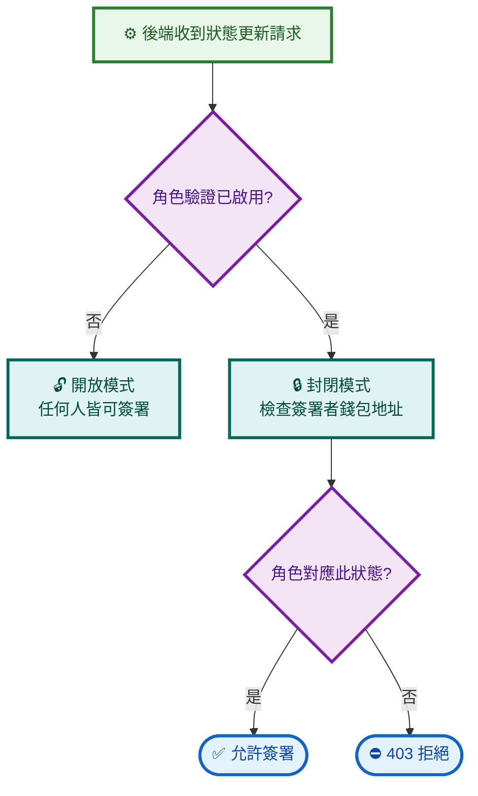
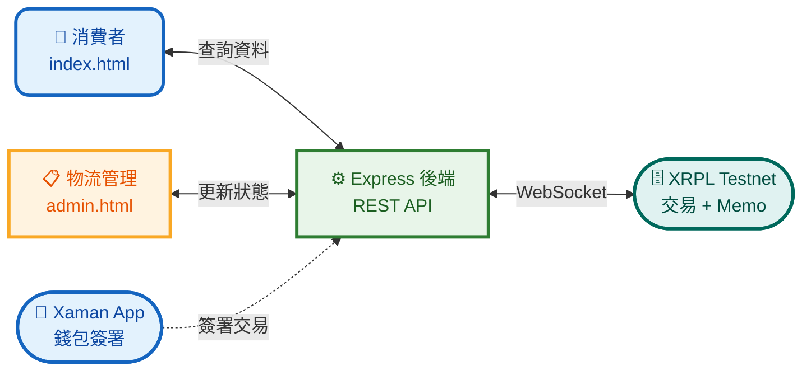

# 🥚 雞蛋產銷履歷系統 — 簡報版流程圖

> 使用情境簡化版 · 適合投影片呈現

---

## 🎨 圖例

| 圖示 | 代表 | 顏色 |
|:----:|------|:----:|
| 👤 圓角 | **使用者**操作 | 藍色 |
| 💻 矩形 | **前端**流程 | 橙色 |
| ⚙️ 矩形 | **後端**系統 | 綠色 |
| 🗄️ 圓角 | **資料**傳遞 | 青色 |

---

## 物流人員完整操作流程

### 流程重點

| 步驟 | 關鍵動作 | 參與者 |
|:----:|---------|:------:|
| ① 登入 | Xaman App 掃碼簽署 → 後端驗證角色 | 👤 物流人員 + 📱 Xaman |
| ② 更新狀態 | 輸入 ID → 系統自動帶入下一步 → Xaman 掃碼簽署 → 寫入 XRPL | 👤 物流人員 + ⚙️ 後端 + 🗄️ XRPL |
| ③ 列印標籤 | 產生 QR → 列印 → 貼在包裝 | 👤 物流人員 + 🖨️ 印表機 |

---

## 消費者查詢溯源

---

## 角色權限驗證

| 狀態 | 需由誰簽署 |
|------|-----------|
| 📦 生產完成 `produced` | 🏭 **製造商** |
| 🚚 運送中 `shipped` | 🚚 **物流中心** |
| 🏪 已上架銷售 `sold` | 🏪 **零售商** |

---

## 系統架構與資訊流

---

> 📅 2026-05-23 · 🥚 雞蛋產銷履歷追蹤系統 · 簡報版流程圖
