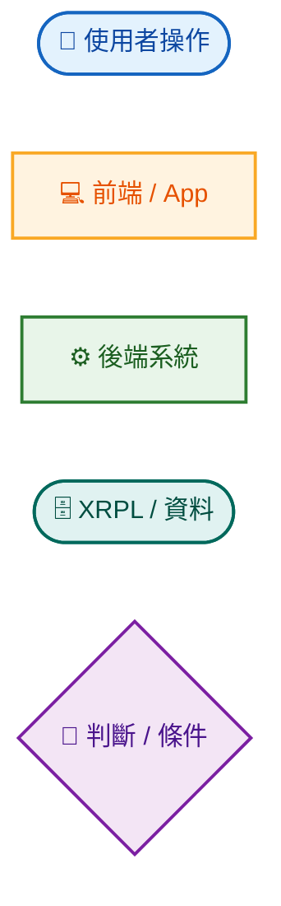
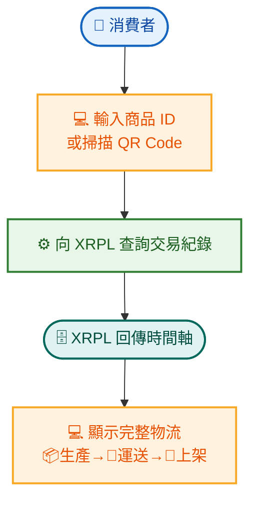
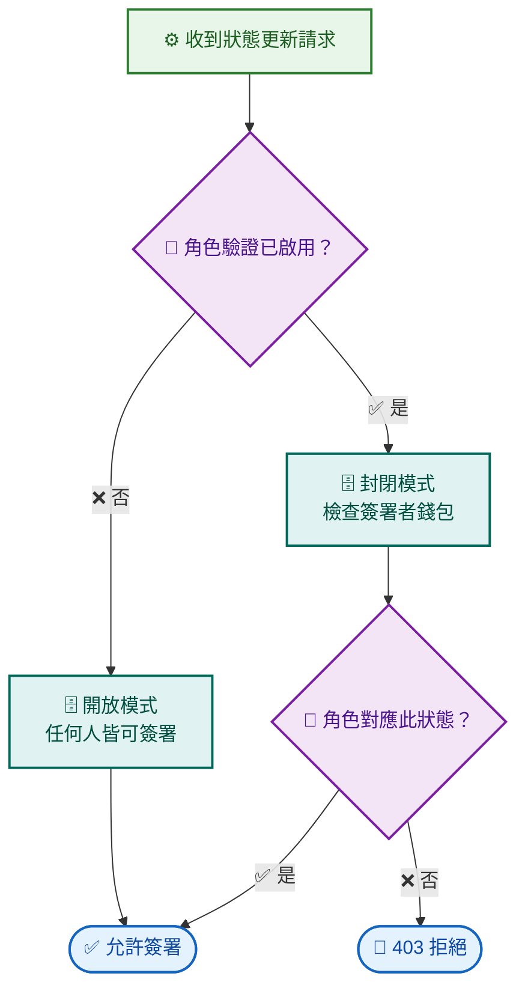
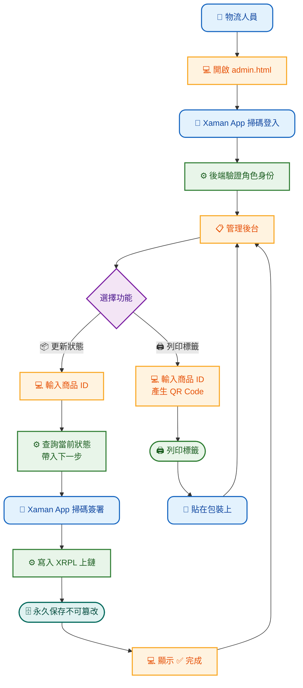
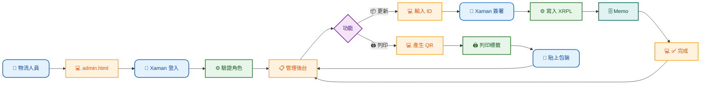
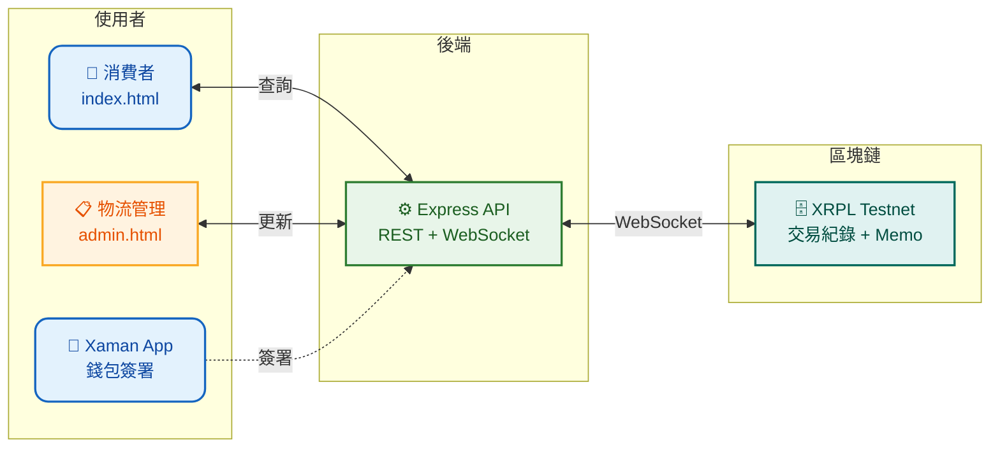

# 🥚 雞蛋產銷履歷系統 — 簡報版流程圖

> 三層架構 · 一頁一流程 · 適合投影片呈現

---

## 📖 圖例（Slide 1）

| 層級 | 代表 | 顏色 |
|:----:|------|:----:|
| 🟦 圓角 | **使用者**操作（物流/消費者） | 藍 |
| 🟧 矩形 | **前端**介面（輸入/顯示/列印） | 橙 |
| 🟩 矩形 | **後端**系統（驗證/查詢/寫入） | 綠 |
| 🟫 圓角 | **資料**傳遞（XRPL/Memo） | 青 |
| 🟪 菱形 | **判斷**條件（驗證開關/角色比對） | 紫 |

---

## 消費者查詢溯源（Slide 2）

> ✅ 消費者只需輸入商品 ID 或掃描包裝 QR Code，即可查看完整物流時間軸

---

## 角色權限驗證（Slide 3）

| 狀態 | 需由誰簽署 |
|:----:|-----------|
| 🏭 生產完成 `produced` | **製造商** |
| 🚚 運送中 `shipped` | **物流人員** |
| 🏪 已上架 `sold` | **零售商** |

---

## 物流人員操作流程（Slide 4）

---

## 物流流程（橫版 — Slide 5）

---

## 🏗️ 系統架構總覽（Slide 6）

---

### 📌 簡報建議

| 重點 | 說明 |
|:----|------|
| **一頁一流程** | 每張投影片只放一個流程圖，避免資訊過載 |
| **三分鐘法則** | 每張圖花 2-3 分鐘講解，先講角色動機再講技術流程 |
| **由簡入深** | Slide 1(圖例) → Slide 2(消費者) → Slide 3(權限) → Slide 4-5(物流) |
| **三層視覺** | 使用者(上) → 前端(中) → 後端/資料(下)，垂直閱讀直覺 |
| **說故事** | 不要照唸流程，可以說「一顆雞蛋從農場到超市，系統怎麼確保資料不被竄改...」 |

> 📅 2026-05-23 · 🥚 雞蛋產銷履歷追蹤系統 · 簡報優化版
