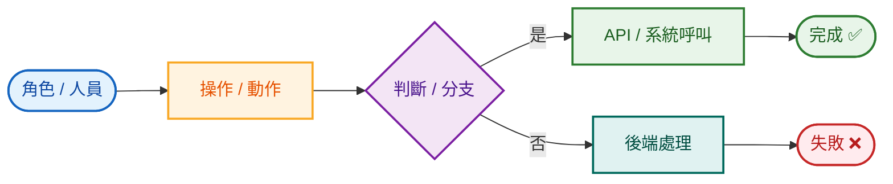
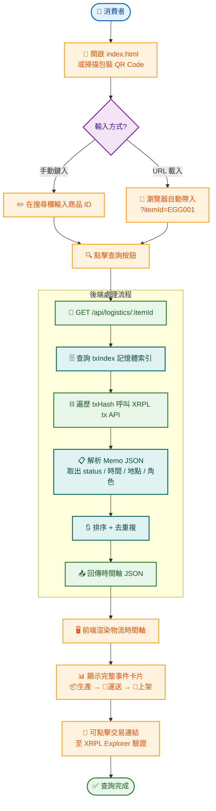
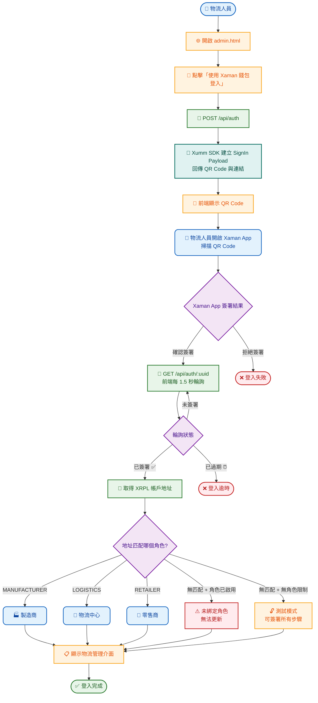
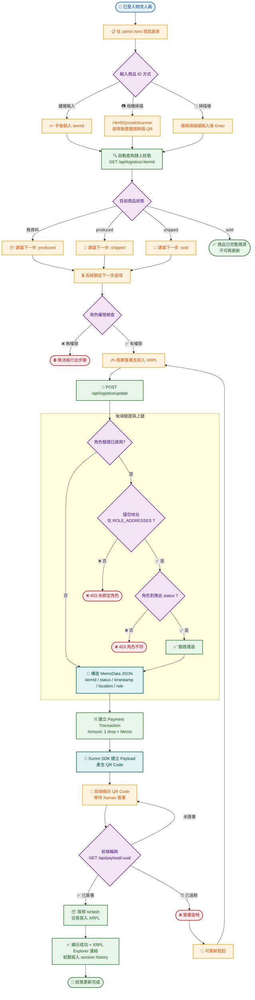
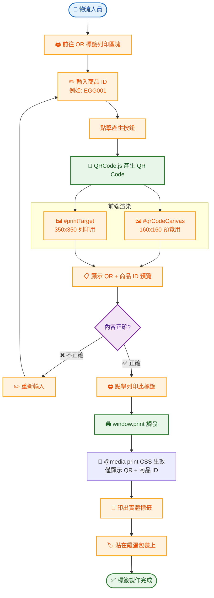
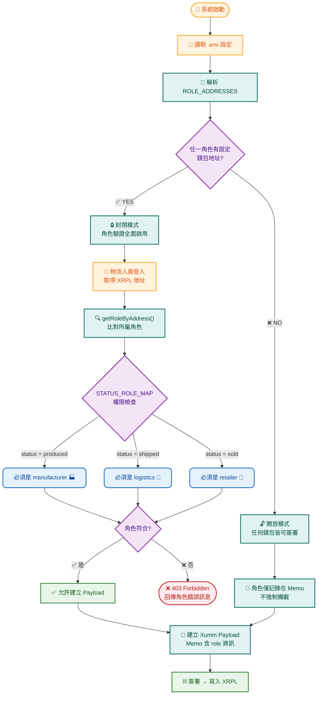
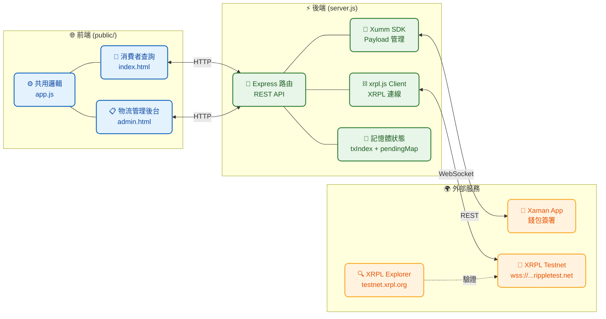
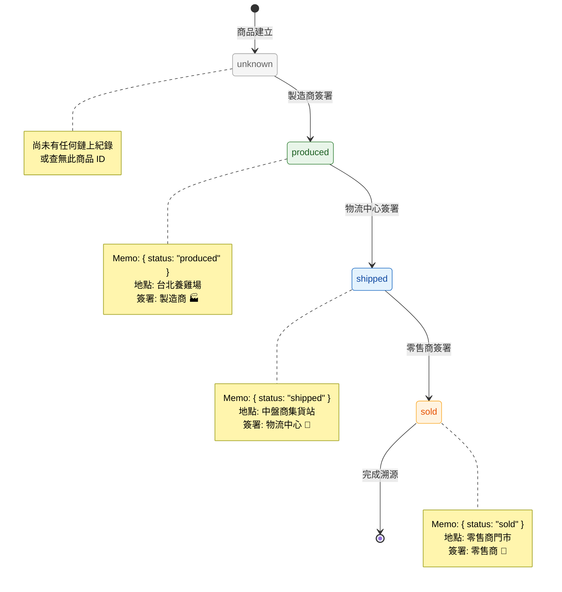
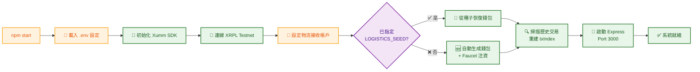

# 🥚 雞蛋產銷履歷追蹤系統 — 使用情境流程圖

> Egg Supply Chain Traceability — Usage Scenario Flowcharts
> 基於 XRPL Testnet + Xaman SDK 的區塊鏈溯源系統

---

## 🎨 圖例說明



| 樣式 | 代表意義 | 顏色 |
|:----:|---------|------|
| ⬤ 圓角矩形 | 角色 / 人員 | 🟦 藍色 |
| ▬ 矩形 | 操作 / 動作 | 🟧 橙色 |
| ◇ 菱形 | 判斷 / 分支 | 🟪 紫色 |
| ⬢ 綠框矩形 | API / 後端呼叫 | 🟩 綠色 |
| ⬢ 青框矩形 | 系統內部處理 | 🟩 青色 |
| ✅ 綠底 | 成功結束 | 🟢 綠色 |
| ❌ 紅底 | 失敗結束 | 🔴 紅色 |

---

## 情境一：消費者查詢溯源



**參與角色：** 👤 消費者  
**關鍵 API：** `GET /api/logistics/:itemId`  
**資料流向：** `index.html → Express → XRPL Testnet → Express → index.html`  
**備註：** 所有資料從 XRPL 鏈上即時讀取，前端以 `Set` 結構處理去重複

---

## 情境二：物流人員登入



**參與角色：** 👤 物流人員、📱 Xaman App  
**關鍵 API：** `POST /api/auth` → `GET /api/auth/:uuid`  
**輪詢機制：** 前端每 1.5 秒呼叫確認簽署狀態，直到 `signed` 或 `expired`  
**角色判定：** 登入成功後，前端以 XRPL 地址比對 `.env` 設定的 `MANUFACTURER_ADDRESS` / `LOGISTICS_ADDRESS` / `RETAILER_ADDRESS`

---

## 情境三：物流狀態更新



**參與角色：** 👤 物流人員、📱 Xaman App  
**關鍵 API：** `POST /api/logistics/update` → `GET /api/payload/:uuid`  
**狀態流轉：** `produced → shipped → sold`（強制順序，由 `NEXT_STATUS_MAP` 控制）  
**XRPL 交易結構：** `Payment` 交易 + `Memo`（`MemoType: "eggtrack/item-status"`，`MemoData: JSON（hex）`）

---

## 情境四：商品 QR 標籤列印



**參與角色：** 👤 物流人員  
**使用套件：** QRCode.js（前端產生）  
**QR Code 內容：** 純文字商品 ID（如 `EGG001`）  
**列印機制：** `@media print` CSS 隱藏所有非列印元素  
**用途：** 印出貼在包裝上，消費者掃描即可查詢溯源

---

## 情境五：角色權限驗證



### 角色對應表

```
STATUS_ROLE_MAP = {
    produced: 'manufacturer',   // 📦 生產完成 → 製造商 🏭
    shipped:  'logistics',      // 🚚 運送中   → 物流中心 🚚
    sold:     'retailer'        // 🏪 已上架   → 零售商 🏪
}
```

| 狀態 | 需簽署角色 | 環境變數 | 說明 |
|------|-----------|---------|------|
| `produced` | 🏭 製造商 | `MANUFACTURER_ADDRESS` | 生產完成 |
| `shipped` | 🚚 物流中心 | `LOGISTICS_ADDRESS` | 運送中 |
| `sold` | 🏪 零售商 | `RETAILER_ADDRESS` | 已上架銷售 |

**運作邏輯：**
1. 各角色可設定多個錢包地址（逗號分隔）
2. 所有角色地址皆未設定 → **開放模式**（任何人都可簽署）
3. 任一角色有設定地址 → **封閉模式**（強制驗證身份，否則回傳 403）

---

## 系統架構總覽



### API 路由一覽

| 方法 | 路由 | 用途 | 對應情境 |
|------|------|------|---------|
| `GET` | `/api/health` | 系統健康檢查 | 維運 |
| `POST` | `/api/auth` | 建立 Xaman SignIn Payload | 情境二 |
| `GET` | `/api/auth/:uuid` | 輪詢登入結果 | 情境二 |
| `POST` | `/api/logistics/update` | 建立物流更新 Payload | 情境三 |
| `GET` | `/api/payload/:uuid` | 輪詢簽署狀態與 txHash | 情境三 |
| `GET` | `/api/logistics/:itemId` | 查詢商品完整物流時間軸 | 情境一 |
| `GET` | `/api/roles` | 回傳角色設定（前端顯示用） | 情境二、五 |
| `GET` | `/api/debug/tx/:txHash` | 除錯：檢視原始 MemoData hex | 開發 |
| `GET` | `/api/health/data` | Health 純 JSON 端點 | 維運 |

---

## 商品生命週期



---

## 系統啟動流程



---

> 📅 文件產出：2026-05-23  
> 📦 專案：egg-tracker / 雞蛋產銷履歷追蹤系統  
> 🛠️ 技術：Node.js + Express + XRPL + Xaman SDK
