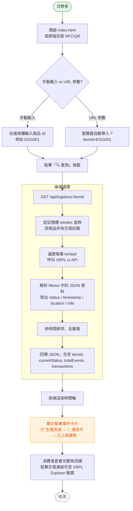
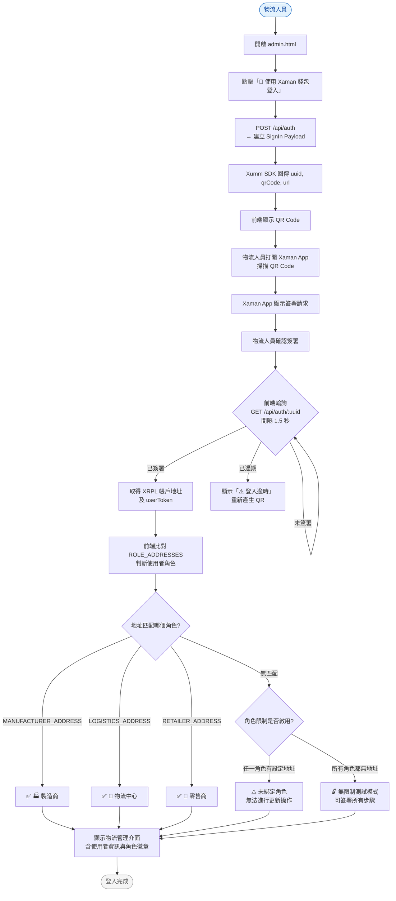
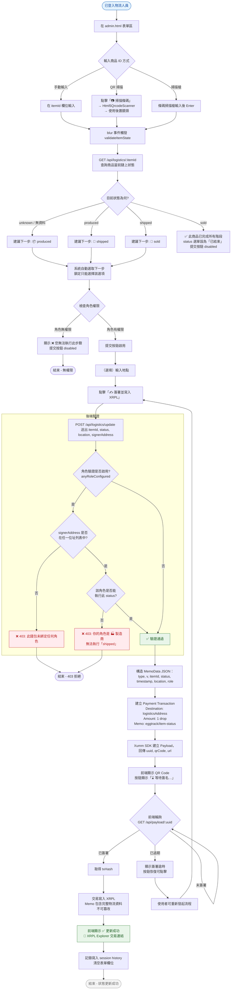
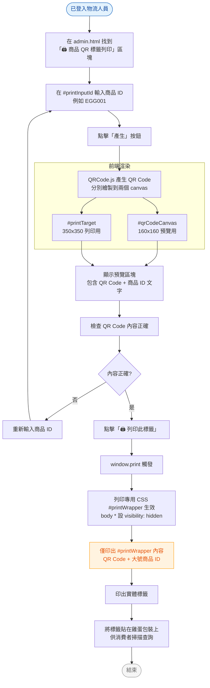
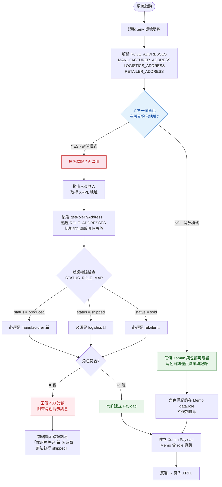
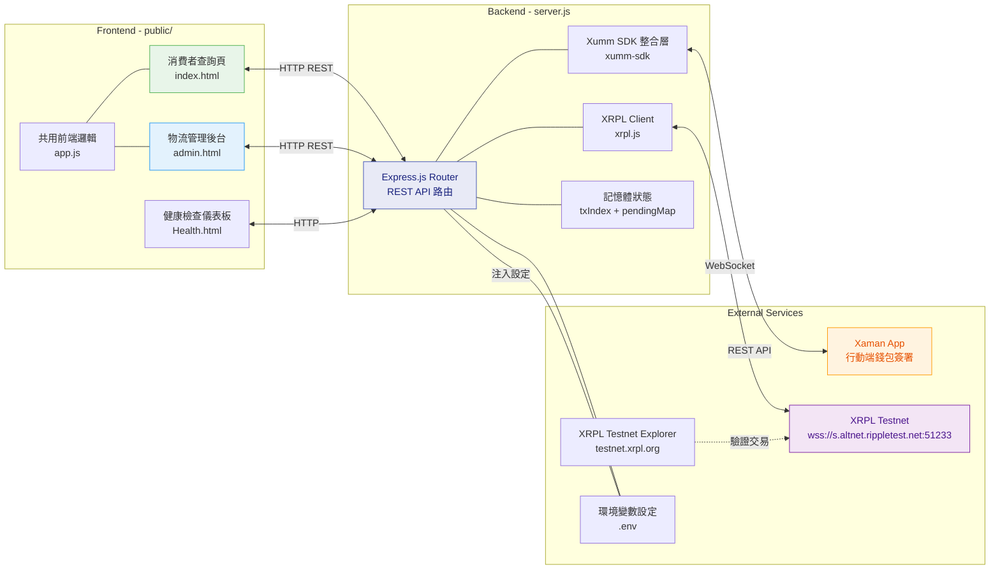
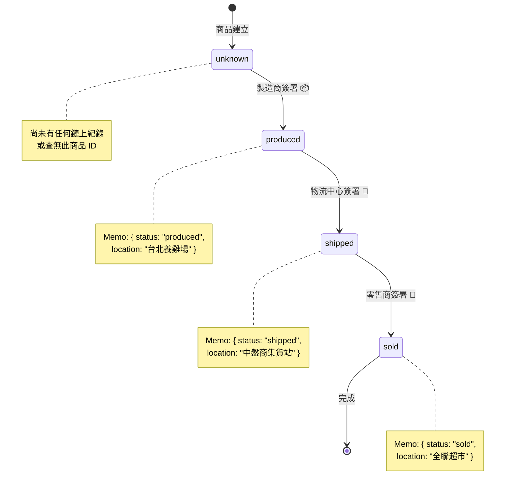
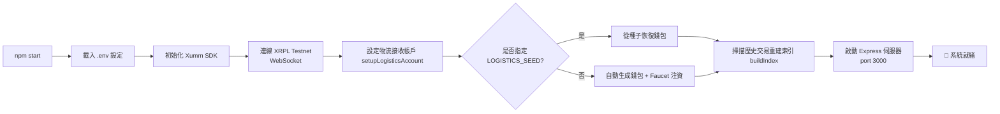

# 🥚 雞蛋產銷履歷追蹤系統 — 使用情境流程圖

> Egg Supply Chain Traceability — Usage Scenario Flowcharts
> 基於 XRPL Testnet + Xaman SDK 的區塊鏈溯源系統

---

## 📋 使用情境總覽

| 編號 | 情境名稱 | 主要角色 | 核心 API |
|------|---------|---------|---------|
| 1 | 消費者查詢溯源 | 消費者 | `GET /api/logistics/:itemId` |
| 2 | 物流人員登入 | 物流人員、Xaman App | `POST /api/auth` → `GET /api/auth/:uuid` |
| 3 | 物流狀態更新 | 物流人員、Xaman App | `POST /api/logistics/update` → `GET /api/payload/:uuid` |
| 4 | 商品 QR 標籤列印 | 物流人員 | QRCode.js 前端產生 |
| 5 | 角色權限驗證 | 後端系統 | `getRoleByAddress()` + `STATUS_ROLE_MAP` |

---

## 情境一：消費者查詢溯源



**參與角色：** 消費者  
**關鍵 API：** `GET /api/logistics/:itemId`  
**資料流向：** index.html → Express → XRPL Testnet → Express → index.html  
**備註：** 所有資料從 XRPL 鏈上即時讀取，不需資料庫；前端使用 `Set` 去重複處理

---

## 情境二：物流人員登入



**參與角色：** 物流人員、Xaman App  
**關鍵 API：** `POST /api/auth` → `GET /api/auth/:uuid`  
**簽署工具：** Xaman (Xumm) App  
**角色驗證：** 後端根據 `.env` 設定的 `MANUFACTURER_ADDRESS` / `LOGISTICS_ADDRESS` / `RETAILER_ADDRESS` 比對簽署者錢包地址  
**輪詢機制：** 前端每 1.5 秒呼叫一次 `GET /api/auth/:uuid`，直到 signed 或 expired

---

## 情境三：物流狀態更新（核心流程）



**參與角色：** 物流人員（已登入狀態）、Xaman App  
**關鍵 API：** `POST /api/logistics/update` → `GET /api/payload/:uuid`  
**XRPL 交易結構：** `Payment` 交易 + `Memo`  
- `MemoType`: `"eggtrack/item-status"`（hex 編碼）  
- `MemoData`: JSON `{ type, v, itemId, status, timestamp, location, role }`（hex 編碼，非 ASCII 轉 `\uXXXX`）  

**狀態流轉強制順序：** `produced → shipped → sold`（由前端 `NEXT_STATUS_MAP` 與後端共同控制）

---

## 情境四：商品 QR 標籤列印



**參與角色：** 物流人員  
**使用套件：** [QRCode.js](https://cdnjs.cloudflare.com/ajax/libs/qrcodejs/1.0.0/qrcode.min.js)（前端產生）  
**QR Code 內容：** 純文字商品 ID（如 `EGG001`）  
**列印機制：** `@media print` CSS 隱藏所有 `body *`，僅顯示 `#printWrapper` 內容  
**用途：** 印出後貼在實體包裝上，消費者掃描即可查詢溯源

---

## 情境五：角色權限驗證流程



### 角色驗證設計原理

```
STATUS_ROLE_MAP = {
    produced: 'manufacturer',   // 📦 生產完成 → 製造商簽署
    shipped:  'logistics',      // 🚚 運送中   → 物流中心簽署
    sold:     'retailer'        // 🏪 已上架   → 零售商簽署
}
```

| 狀態 | 需簽署角色 | 環境變數 | 標籤 |
|------|-----------|---------|------|
| `produced` | manufacturer 🏭 | `MANUFACTURER_ADDRESS` | 製造商 |
| `shipped` | logistics 🚚 | `LOGISTICS_ADDRESS` | 物流中心 |
| `sold` | retailer 🏪 | `RETAILER_ADDRESS` | 零售商 |

**運作邏輯：**
1. 各角色支援多個錢包地址（逗號分隔）
2. 如果所有角色的地址都留空 → **開放模式**（任何人都可簽署，角色僅供紀錄）
3. 只要任一角色有設定地址 → **封閉模式**（強制驗證簽署者身分）
4. 簽署不合法的組合 → 後端回傳 `403` + 明確的中文錯誤提示

---

## 系統整體架構與資料流



### API 路由總覽

| 方法 | 路由 | 說明 | 所屬情境 |
|------|------|------|---------|
| `GET` | `/api/health` | 系統健康檢查（支援瀏覽器/JSON 兩種模式） | 系統維護 |
| `POST` | `/api/auth` | 建立 Xaman SignIn Payload，回傳 QR Code | 情境二 |
| `GET` | `/api/auth/:uuid` | 輪詢登入結果 | 情境二 |
| `POST` | `/api/logistics/update` | 建立物流更新 Payload，回傳 QR Code | 情境三 |
| `GET` | `/api/payload/:uuid` | 通用 Payload 輪詢（簽署狀態、交易 Hash） | 情境三 |
| `GET` | `/api/logistics/:itemId` | 查詢商品完整物流時間軸 | 情境一 |
| `GET` | `/api/roles` | 回傳角色設定（給前端顯示） | 情境二、五 |
| `GET` | `/api/debug/tx/:txHash` | 檢查原始 MemoData hex（除錯用） | 開發除錯 |
| `GET` | `/api/health/data` | Health API 純 JSON 資料端點 | 系統維護 |

---

## 狀態機：商品物流生命週期



---

## 📝 補充說明

### 前端共用邏輯（app.js）

`app.js` 被 `index.html` 和 `admin.html` 共同引用，提供以下功能：

- **`api(method, path, body)`** — 統一的 API 呼叫封裝
- **`pollPayload(uuid, callbacks)`** — 每 1.5 秒輪詢 Payload 狀態
- **`showQR(containerId, payload)` / `hideQR(containerId)`** — QR Code 顯示控制
- **`renderTimeline(containerId, transactions)`** — 時間軸渲染（消費者頁面用）
- **`xrplLink(txHash, label)`** — 產生 XRPL Explorer 連結
- **`formatDate(iso)`** — 日期格式化（`zh-TW` / `Asia/Taipei`）

### 系統啟動流程



---

> 文件產出日期：2026-05-23  
> 專案名稱：egg-tracker / 雞蛋產銷履歷追蹤系統  
> 技術棧：Node.js + Express + XRPL + Xaman SDK
